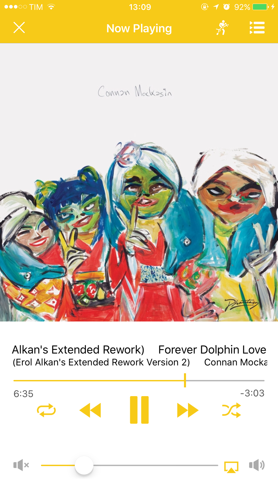
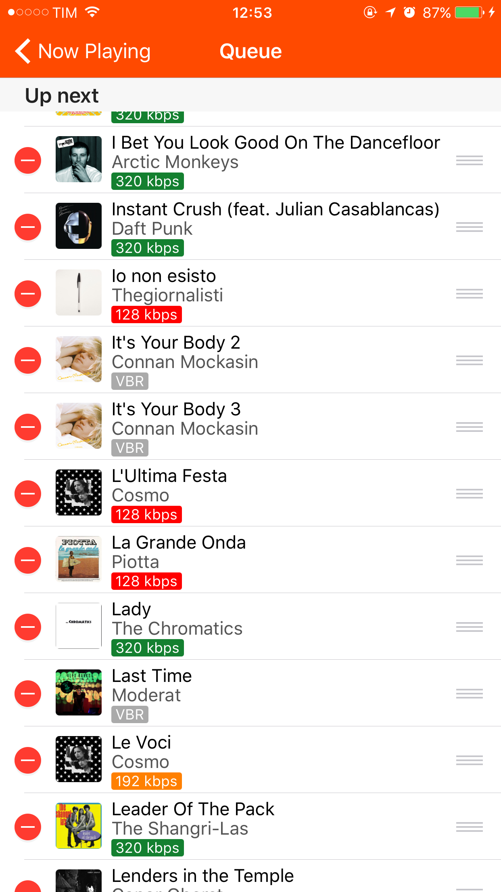
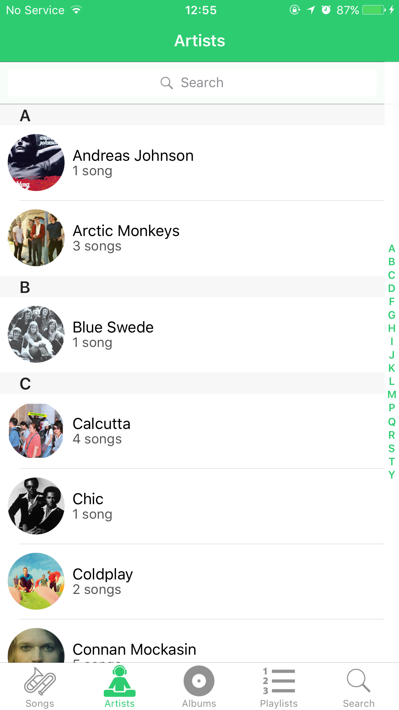
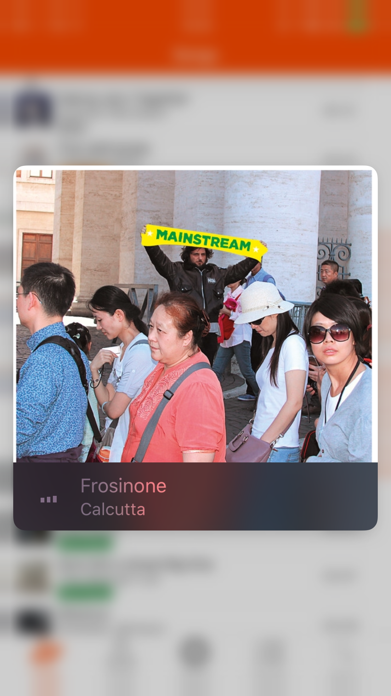
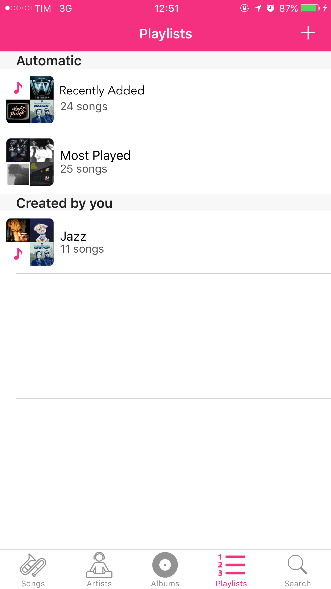

# Open Music — an open music player for iOS

***Old unmantained Swift 3.x app***

Music player | Music queue | Music Library
:-----------:|:-----------:|:-------------:
  |    |  

Open Music let's you search for unlicensed audio files from the web, for example your favorite podcasts or the track from your improvised DJ friend that has always a new song ready for your ears.

You can create your personal playlists but Open Music helps you with managed ones to keep track of your recently added song and the ones you play the most. Also you can rearrange live your queue, for that song you wanna listen before the others or the one you wanna delete because it's boring.

Thanks to 3D Touch you can peek and preview a track you saved offline, in case you remember the jingle, but can't come up with the title.

Wanna sing out loud? Musixmatch integration let's you do that, bringing lyrics into the app!

All in a simple, elegant and blue interface.

3D touch preview | Music playlists
:-----------:|:-----------:
  |  